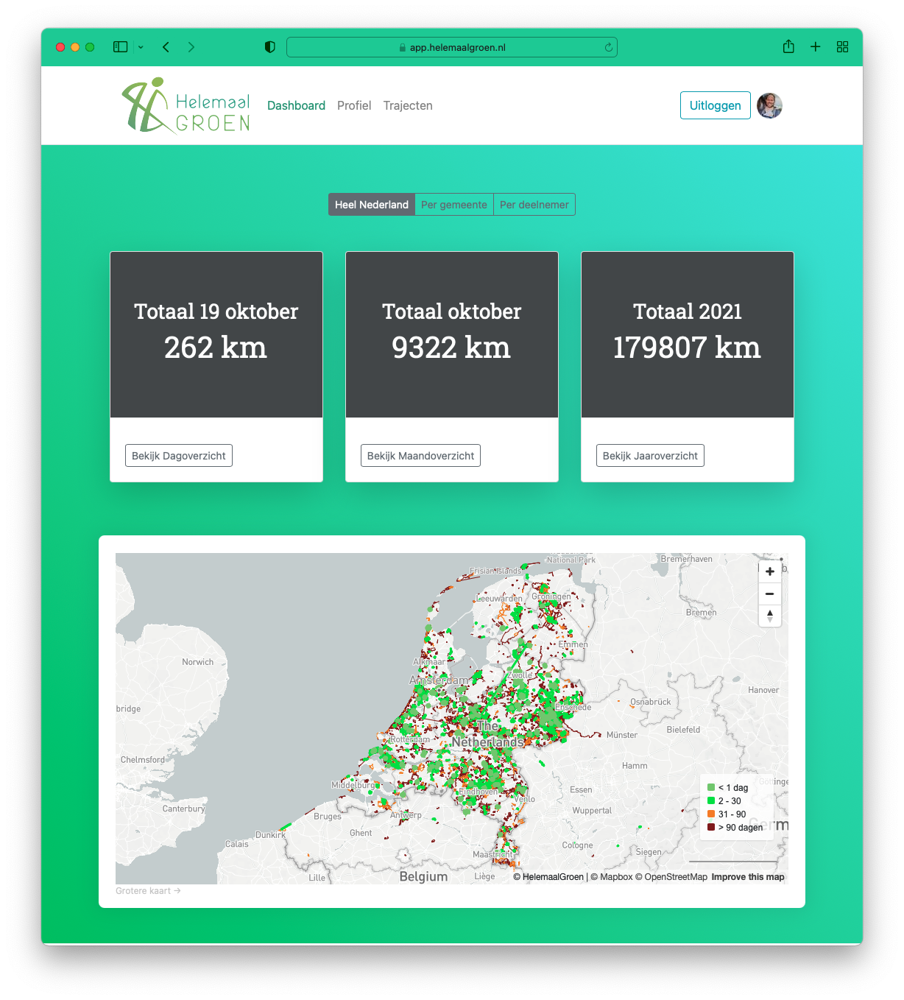
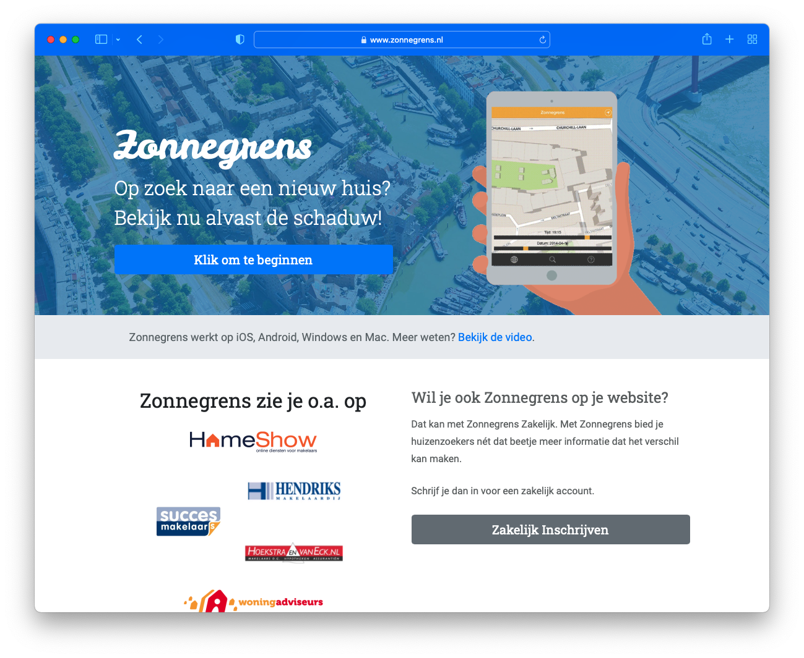
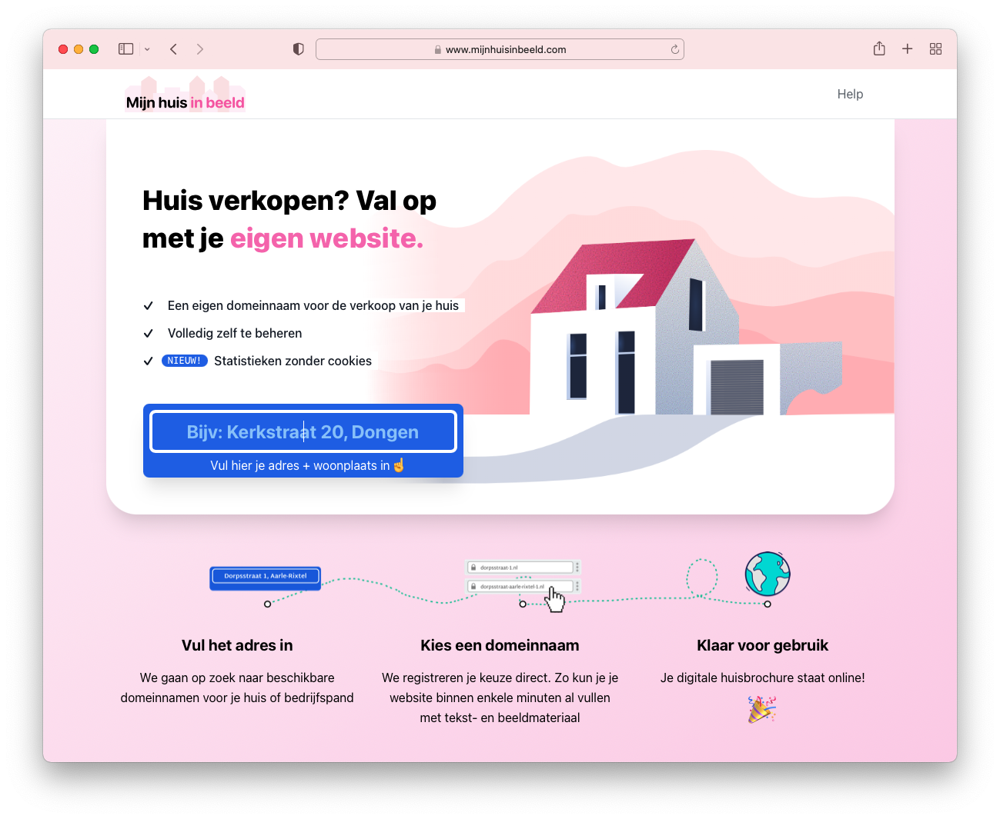
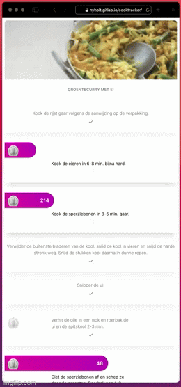

Side projects that I'm currently working on.

# HelemaalGroen

[HelemaalGroen](https://app.helemaalgroen.nl/) is a web application founded by Jaap de Boer, a retired veterinarian, who came up with the concept after being forced to walk instead of cycle after a cycling accident.

While walking, he noticed the large amounts of litter in the streets and decided to make a website to help people find and clean up litter.

The concept is to allow people to use a smartphone while they clean up litter. The app tracks their location and logs the route, similar to how Strava works. When a cleaning route is completed, it appears on a map as green. This shows to other users that it has been cleaned recently. After 30 days it begins to turn orange and then brown, and then it disappears.

> The greener the map, the cleaner the streets.

I've built the application using Django and PostGIS on a DigitalOcean droplet. The MVP had a Strava integration, so the app part was handled by using Strava. Later on, a third party built dedicated iOS and Android apps for the project.

# Zonnegrens

[Zonnegrens](https://zonnegrens.nl/) is a web application which shows the shadow cast by real estate on a map. It is a project I started in 2016 and it's generating quite a stable revenue flow. It's not recurring in the SaaS way, but the avg monthly revenue is around €500. Built with Django and PostGIS.

# Mijn huis in beeld

This project was born out of a need to show my house on a website. I wanted it to be a top-level domain name, but this is quite a hassle, so this project does everything automatically. Users can register their domain name (streetname + housenumber + city) and the website will register the domain for them. After registration, users can choose a theme, provide details about the house and upload images. Then the website will automatically create a website for the house to sell.

See [https://www.mijnhuisinbeeld.com/](https://www.mijnhuisinbeeld.com/) (in progress)

# Small projects

## QR finder

QR Finder is a web application that allows you to create QR code stickers. When the code gets scanned, a URL opens with details about the object, the owner etc.

## QRDoorbell

Similar to the QR Finder project, but when the QR code gets scanned, a pre-defined phone number gets called via Twilio, to replace the physical doorbell. Allows for a flexible doorbells setup.

## WhatsMail

Why does email have to look so formal? Dear sir? Sincerely? Times have changed. WhatsMail is a web application that looks exactly like WhatsApp, UI-wise. But it uses good-old e-mail under the hood. People like to use whatsapp because it's quick and easy to use. This projects attempts to borrow the UI of whatsapp to bring a better UX to email.

## CookTracker

[CookTracker](https://nyholt.gitlab.io/cooktracker/) is a web application that allows multiple timers to run in a recipe. Just follow the steps and the timers will start when you are ready.

