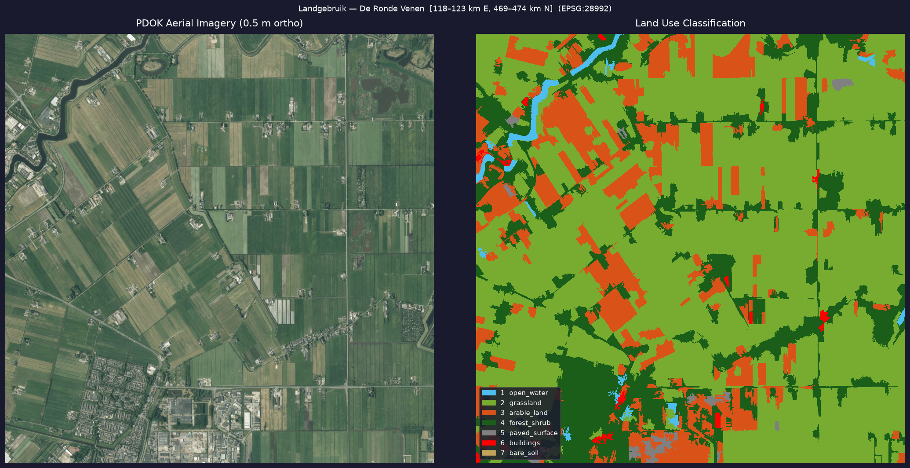

Hydrological models like Rana (formerly 3Di) need land use maps. They determine how water behaves across a landscape: how fast it infiltrates, how rough the surface is, how much it can store. Right now, those maps are produced by STOWA — a labour-intensive process that yields detailed maps with dozens of classes covering both physical and functional land use.

But for modelling purposes, only physical land use matters. And physical land use can be derived from aerial imagery.

I built a pipeline that does this automatically. The code is at [github.com/gijs/landuse-from-aerial](https://github.com/gijs/landuse-from-aerial).

## Seven classes are enough

A hydrological model doesn't need thirty land use classes. What matters is: is the surface sealed or permeable? Does it dry quickly or slowly? Is there canopy interception? For that, seven classes suffice:

1. open water
2. grassland / meadow
3. arable land
4. forest / shrub
5. paved surface
6. buildings
7. bare soil

Those seven classes can be derived from ordinary RGB aerial photography with reasonable accuracy — no field surveys, no labelled training data.

## The approach: superpixels and colour rules

The input is the publicly available PDOK aerial imagery — 25 cm ortho, updated annually, open data. The pipeline downloads a tile via WMS, segments the image into superpixels using the SLIC algorithm, then classifies each segment based on colour and texture.

SLIC divides an image into compact, colour-homogeneous segments — similar to how the eye quickly distinguishes regions. A segment of around 70 metres diameter is the right scale for polder land use: small enough to separate a dike from a meadow, large enough not to get lost in noise.

For each segment, the pipeline computes mean R, G, B, normalised chromaticity, and a texture proxy (variance via uniform filter). A hierarchy of colour rules then assigns a class:

- Dark + slight blue cast + low texture → open water
- Red-dominant or high variance → buildings
- Near-grey + low texture → paved surface
- Green-dominant + dark + textured → forest / shrub
- Green-dominant + bright or calm → grassland
- Warm brown (R > G > B) → bare soil
- Dark + low variance (fallthrough) → arable land

No neural network, no GPU, no labelled training data. It runs in two and a half minutes on a laptop.

## Test area: De Ronde Venen

The test tile is a 5×5 km patch in the peat meadow polder near Vinkeveen — a classic Dutch landscape of grassland, drainage ditches, some woodland, a village, and through roads.

The resulting breakdown:

| Class | Area | Share |
|---|---:|---:|
| grassland | 1,579 ha | 63.1% |
| forest / shrub | 471 ha | 18.8% |
| arable land | 394 ha | 15.8% |
| open water | 26 ha | 1.0% |
| paved surface | 18 ha | 0.7% |
| buildings | 11 ha | 0.4% |
| bare soil | 1 ha | 0.0% |

63% grassland is exactly right for a peat meadow area. Buildings and paved surfaces in the north-west corner are correctly identified. Forest and shrub patches along field boundaries come through clearly.

What works less well: the water percentage is too low. Drainage ditches of 2–3 metres width fall below the effective resolution of 70-metre superpixels. Using finer segments (0.5 m/px) and adding a NIR band from the PDOK CIR imagery would significantly improve ditch detection.

## Why not a neural network?

The obvious next step seems to be a pretrained segmentation model. But there are complications.

**ADE20K models** (SegFormer, DeepLabV3+) were trained on street-level photographs. They recognise a car from the side, not a roof from above. On nadir aerial imagery they produce nonsensical results.

**ISPRS Potsdam models** were trained on 5 cm German aerial imagery with 6 classes — the right domain — but no packaged inference tool exists. Fine-tuning requires a GPU and labelled data.

**SAM** (Meta's Segment Anything Model) produces excellent segment boundaries, including for narrow ditches and small buildings, but assigns no semantic labels. A classifier still has to sit on top of it. The pipeline supports SAM as an option (`USE_SAM = True`), but requires a 375 MB checkpoint and a GPU for usable speed.

For production use, the right move is to collect 100–200 manually labelled polygons from this material and fine-tune a SegFormer-B2. Thirty minutes of GPU training typically pushes accuracy above 90%. But even the current rule-based approach is good enough as a baseline.

## What this means in practice

The output is a GeoTIFF with an embedded colour table (drag directly into QGIS, CRS EPSG:28992) and a GeoPackage with dissolved polygons per class. Both are ready to use as Rana input.

The underlying idea is straightforward. If the STOWA maps become too slow or too expensive to maintain on an annual cycle, there is an alternative that runs entirely on public data and open source software, can be updated in minutes whenever new aerial imagery is released, and is accurate enough for the purpose.

The code is at [github.com/gijs/landuse-from-aerial](https://github.com/gijs/landuse-from-aerial).
