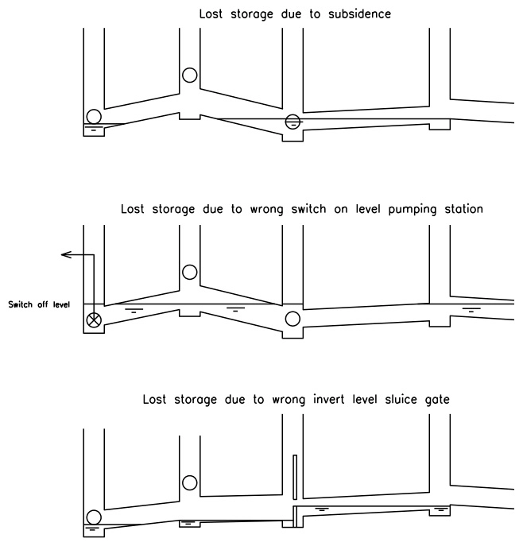

Every sewer network has a design capacity: the volume it can buffer during a storm before it starts surcharging. But a surprising part of that capacity is often not actually available. Somewhere in the pipe run, a sag in the invert, a pump that switches off too early, or a weir with the wrong crest level creates a local low point that is *permanently* full of water. It never drains, storm or no storm. Water engineers in the Netherlands call this **verloren berging** (lost storage) and quantifying it is standard practice when assessing a sewer system's real buffering capacity.


## The problem, visually



There are 3 classic causes, and they all share the same underlying shape: the pipe network's invert profile goes *up* before it goes back *down* again.

1. **Subsidence**: a pipe or manhole has settled, creating a dip that's lower than what's downstream of it.
2. **Wrong pump switch-off level**: a pumping station's lower stop level sits above the lowest point it's actually supposed to empty.
3. **Wrong sluice gate / weir invert**: a structure's crest blocks drainage to a point that is, in reality, lower.

In every case, the mechanism is identical: pour water into the network from its outfall, let it find its own level, and wherever the terrain (or rather, the *pipe* terrain) rises before falling again, a pocket of permanently trapped water forms behind it.

## Why the old tool stopped working

At Rana, we had an existing implementation, `lost_capacity.py`, written for the legacy 3Di schematisation format: a `Manhole`/`Sewer` Django-style data model, Python 2, and `networkx` for the graph. The core idea in that code was genuinely elegant: a priority-queue flood-fill that walks the network from a sink outward, discovering "peaks" and seeding new pools behind them. However, it was tied to a data model that no longer exists. Schematisations now live in Rana (the modern successor to 3Di), stored as a GeoPackage with a
completely different table layout: `connection_node`, `pipe`, `culvert`, `weir`, `orifice`, `pump`, `pump_map`, `boundary_condition_1d`.

The algorithm was worth keeping but the data layer needed a bit of a rewrite.

## Mapping the new schema onto the same idea

The first real work was reverse-engineering what the Rana schema actually represents, since the shape of the solution falls straight out of it:

- **`connection_node`** is a manhole: it has a `bottom_level` (invert) and a `storage_area` (its cross-sectional footprint, for turning a trapped *depth* into a trapped *volume*).
- **`pipe`** / **`culvert`** connect two connection nodes and carry their *own* invert at each end (`invert_level_start` / `invert_level_end`), which can differ from the manhole's own   bottom level if there's a drop structure at that manhole. That distinction matters: it's exactly the kind of detail the old tool's separate "put" and "sewer_end" graph nodes existed to capture, and we kept the same structure.
- **`weir`** / **`orifice`** are barriers with a `crest_level`. Water can't cross below it, no matter how low the invert is on either side.
- **`pump`** + **`pump_map`** are a two-table relationship: the pump row has the *suction* side and a `lower_stop_level`; the discharge side lives in a separate mapping table. A few pumps in our test data had no mapped discharge at all. They pump straight out of the modelled area. We treat those as outfalls in their own right, draining their suction node down to the lower stop level and no further.
- **`boundary_condition_1d`** is the actual outfall: a fixed (or time-varying) water level imposed by the receiving water body.

All of this gets folded into one graph. A manhole is a node. Each pipe end is *also* a node (so a drop structure at a manhole shows up as an edge between two different levels). Weirs, orifices and pump barriers are represented as a synthetic node sitting at their crest/stop level, wedged between the two connection nodes they separate, which means a weir behaves exactly like a local "hill" in the invert profile, without needing any special-cased logic in the flood-fill itself.

## The algorithm, in short

Picture pouring water into the network from every outfall simultaneously. Water fills upward from each source. The moment it reaches a point where the invert starts climbing, it keeps rising there too, as long as the invert keeps climbing. The moment the invert turns back *downward* on the far side of that climb, you've found a peak: a new pool starts there, seeded at the peak's own level, and the flood-fill continues from that pool outward.

This is a well-known pattern; a multi-source **priority flood**, the same family of algorithm GIS tools use to fill depressions in a digital elevation model so water doesn't get stuck in them during a hydrological simulation. Here we're running the same idea in one dimension, over a pipe network graph instead of a 2D raster, using a priority queue to always process the lowest pending water level first.

The nice part: because weirs and pumps are just nodes with a `bob` value sitting in the graph, they don't need special treatment in the flood-fill loop at all. A pump's switch-off level is, mechanically, indistinguishable from a sagging pipe invert. It's just another kind of local peak. That symmetry is also what let us *tag* each pool with its cause for free: whatever kind of node formed the peak that bounds a pool, that's the cause we report for everything trapped inside it.

## What comes out

Per connection node and per pipe/culvert, we get a resting water level, a trapped depth, and a volume (computed by numerically integrating the actual cross-section. Exact for circular and tabulated profiles, a documented rectangular approximation for egg-shaped ones). Every trapped pool is reported separately, with a plain-language description of what's causing it: `peak at weir #62`, `pump _02_RG04-1 (discharges outside model)`, and so on. So instead of just a number, you get a worklist.

On our test schematisation that adds up to roughly **10,800 m³ of lost storage**: about 7,700 m³ from profile dips, 3,000 m³ from weir/orifice crests, and the rest split between pump switch-off levels and the receiving water's own level. Results are written as CSVs for further analysis, plus GeoJSON in both the schematisation's native projected CRS (for QGIS) and WGS84 (so it renders directly in a browser, geojson.io, or GitHub's file preview, no GIS software required).

The tool also refuses to guess where it shouldn't. A handful of small sub-networks in our test extract had no path to any outfall at all. This is an edge effect of clipping a larger model down to one area. Rather than silently excluding them from the total, the script lists them in their own CSV so they can be checked by hand.

## Shipping it as a single file

The implementation leans on `pyogrio` for reading the GeoPackage, `shapely` for geometry, and `pyproj` for the WGS84 reprojection, and nothing else. It ships as one executable script with its dependencies declared inline ([PEP 723](https://peps.python.org/pep-0723/)), so running it is just:


```bash
uv run lost_storage.py "data/20250268 situatie 2025.gpkg" -o output_dir
Reading data/20250268 situatie 2025.gpkg ...
  5855 connection nodes, 5987 pipes/culverts, 30 outfalls/seeds
  warning: connection_node matching_culverts_cnode: no bottom_level, using lowest connected invert -1.010
  warning: connection_node matching_culverts_cnode: no bottom_level, using lowest connected invert -0.877
  warning: connection_node matching_culverts_cnode: no bottom_level, using lowest connected invert 1.400
  warning: 7 connection node(s) have no storage_area; treated as 0 m2 (depth-only reporting)
  warning: 583 pipe(s)/culvert(s) use a non-circular, non-tabulated cross-section (egg, etc.) -- their volume is approximated as a rectangular box of the same nominal width x height, see module docstring
Computing resting water levels (priority flood) ...
  warning: 3454 network elements have no path to any outfall (disconnected sub-network, e.g. edge of a clipped extract) -- excluded from totals, listed in unreached_components.csv
Writing results to output_dir ...

Total lost storage:     10843.6 m3
  in manholes:          1977.3 m3
  in pipes/culverts:    8866.3 m3
  by cause:
    profile_dip          7724.2 m3
    structure_crest      3038.6 m3
    boundary_level       77.8 m3
    pump_switch_off      2.9 m3
Separately bounded pools found: 1154
```

`uv` resolves and installs the three dependencies into an isolated environment on first run.

So, no project to set up, no virtualenv to activate; just a script and a GeoPackage.

## What's still missing

Open water channels aren't modelled yet, the schema represents them as a chain of cross-section stations rather than two end inverts, which the current graph-building code doesn't handle. For a pure sewer network that's a non-issue, but a mixed network with open watercourses would need that extended. And as noted, egg-shaped pipe cross-sections get a rectangular approximation rather than their exact geometry, a reasonable trade for a planning-level estimate, less so if you need the volume to the litre.

Both are natural next steps if this becomes something more than a one-off analysis script.