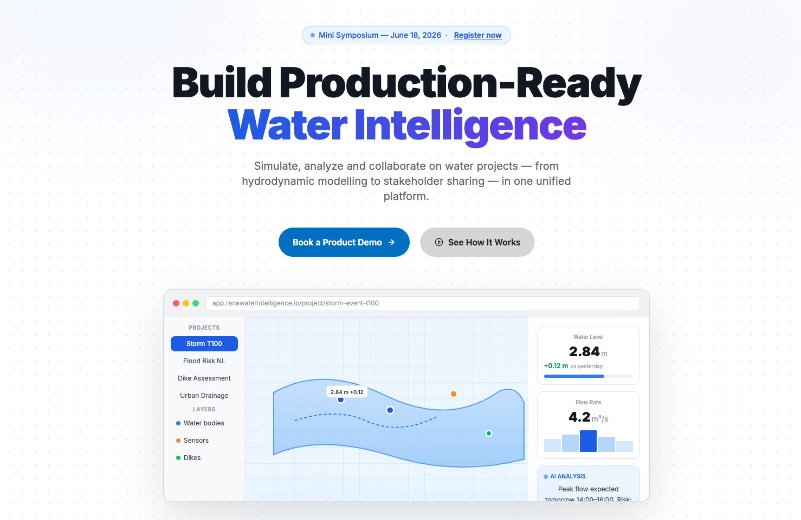

The current [Rana Water Intelligence](https://ranawaterintelligence.io/) website does its job, but I think there's room for improvement. The website uses a system font stack, a layout pattern common to B2B SaaS around 2018 — alternating text-and-image blocks, suboptimal CTA, content floating without a clear structure. Nothing wrong with any of that, but it no longer reflects what the product has become.

I put together a proposal for a redesign. It's live at [gijs.github.io/ranawaterintelligence.io](https://gijs.github.io/ranawaterintelligence.io/).

## What changed and why

**Typography.** The proposal switches to Inter throughout. Inter was designed for screen readability at small sizes, and it has become the de facto standard for technical SaaS products — not because everyone is copying each other, but because it genuinely works: neutral enough to stay out of the way, precise enough to convey competence. The current site uses the browser's default sans-serif stack, which varies by platform and gives the site an unfinished quality on Windows in particular.

**Colour.** The current site uses a fairly generic blue-grey palette with dark charcoal CTAs. The proposal sharpens this into a considered system: a strong blue (#2563EB) as the primary action colour, a purple-to-blue gradient for key typographic moments, and neutral greys for everything structural. The gradient isn't decorative — it marks the product name as a distinctive visual element that can carry across other materials.

**Hero section.** The biggest structural change is the hero. The proposal leads with a bold headline, a gradient treatment on "Water Intelligence", a short subline, two clear CTAs, and — crucially — a product screenshot. The screenshot is not a stock photo or a diagram: it's the actual interface (simplified), showing real project data. This is a deliberate choice. Water professionals evaluating a platform don't need to be told it's powerful; they need to see what it looks like to use it.

**Navigation.** The proposal uses a frosted glass nav bar with backdrop blur, which keeps it legible over both light and image backgrounds without adding visual weight. The current site's nav is functional but flat, and it disappears into the page on scroll in a way that makes the site feel less polished.

**Micro-interactions.** Feature cards lift subtly on hover; sections animate in on scroll. These are small things, but they matter. They signal that the product is actively maintained and that someone is paying attention to the details — important cues when you're asking engineering firms and water authorities to invest in a long-term platform relationship.

**Structure.** The current site is organised around company information. The proposal is organised around what the user is trying to accomplish: simulate, collaborate, share. The section order reflects a user journey rather than a company org chart.

**Fun.** The proposal adds a few playful touches: the gradient on "Water Intelligence", the subtle hover lift on feature cards, and the animated section transitions. These are not gimmicks; they are small ways to make the site feel more alive and engaging without undermining its professional tone.

## What stays the same

The proposal keeps the client logos. Rana is used by municipalities, engineering consultancies, and water authorities across the Netherlands and beyond — showing that is more persuasive than anything in the body copy, and the current site is right to put it front and centre.

The overall tone stays professional and technical. This is not a consumer product, and the design doesn't try to make it feel like one. The goal is to bring the visual presentation up to the level of the product itself — not to rebrand it as something it isn't.

## Next steps

The proposal is a static HTML/CSS build, straightforward to hand off or to use as a reference for a CMS-based implementation. The design system (type scale, colour tokens, component spacing) is consistent enough to extend to documentation, email templates, and in-app surfaces without starting from scratch.