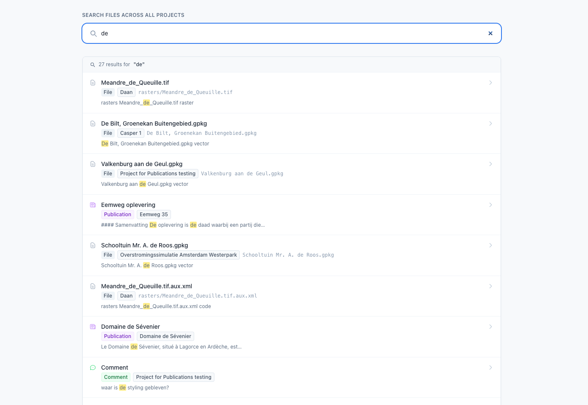
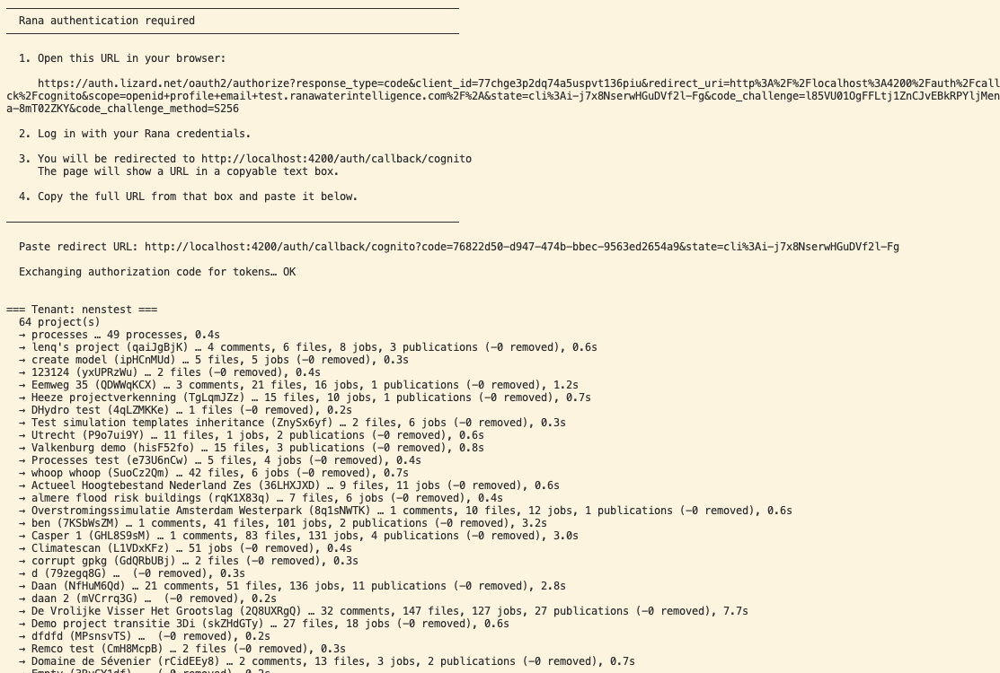

One of the first things I wanted to do while working on the HTMX rewrite was search. Not Google-scale search but practical and fast search across a Rana organisation's data: find a file buried three directories deep in a project, locate a publication by keyword, pull up a processing job by name. The kind of search that feels basic but turns out to need some thought.

The obvious answer is Elasticsearch, or Typesense, or Meilisearch. Stand up another service, sync data into it, query it. For this PoC, I did not want another service. 

So I used SQLite.


## The Architecture in One Sentence
A Django management command crawls the Rana API and writes everything into a SQLite database. One database file per tenant, using SQLite's built-in FTS5 full-text search engine. Search queries read directly from that file.

That's it.

## The Crawl
The Django management command (`crawl_search_index`) is the workhorse. It is run with a tenant ID and a bearer token:

```
python manage.py crawl_search_index --tenant nenstest
```

It then does something conceptually simple: walk every entity in the tenant and write it into a search index. In practice, that means:

For each project, it recursively walks the entire file tree using the `files/ls` endpoint with cursor-based pagination. Directories are traversed but not indexed — only actual files get written. File paths are tokenised by splitting on slashes, which means searching for "rainfall" finds `hydrology/rainfall/2024_q1.nc` even though the word only appears once across a three-level path.

Alongside files, it crawls publications, processing jobs, and publication comments. Each entity type gets flattened into two text fields: a `title` (the file name, publication name, or job name) and a `body` (description, tags, file path components, process name, or comment text). That flattening is the only real design decision in the crawler — everything that should be searchable goes into `body`, and BM25 does the rest.

The result for a medium-sized tenant crawl looks something like:

```
=== Tenant: nenstest ===
  12 project(s)
  → processes … 47 processes, 1.2s
  → Amsterdam watersheds (abc-123) … 1,204 files, 8 publications, 3 jobs, 0.0s
  → Rhine basin (def-456) … 892 files, 2 publications, 14 jobs, 0.1s
  …
```



## The Database
Each tenant gets a single SQLite file at `var/search_index/{tenant_id}.db`. 

The schema is minimal by design:

```
CREATE VIRTUAL TABLE search_index USING fts5(
    entity_type UNINDEXED,
    entity_id   UNINDEXED,
    project_id  UNINDEXED,
    branch      UNINDEXED,
    title,
    body,
    tokenize = 'porter unicode61'
);
```

The `UNINDEXED` columns store metadata needed to generate result links — entity type, ID, project — without contributing to the search index. The `title` and `body` columns are what FTS5 actually tokenises and searches.

The tokenizer is `porter unicode61` — Porter stemming on top of Unicode-aware word splitting. That means searching for "rainfall" matches "rainfalls" and "raining", and handles filenames with accented characters correctly without any extra work.

A second table, `crawl_state`, records when each project was last crawled and how many files were found. That timestamp is used for diagnostics and future incremental sync.

WAL mode is enabled so reads during a crawl do not block each other. The crawler writes and the web app reads from the same file without coordination overhead.

## Reconciliation, Not Replacement
The crawler does not truncate and rebuild on every run. Instead it reconciles per entity type per project. Before writing, it reads the existing row IDs for that entity type in that project. After writing new rows, it deletes any that were present before but not seen in the current crawl. Files that have been deleted from the API disappear from the index. New files appear. Unchanged files are replaced in place (delete then insert, since FTS5 does not support updates cleanly).

This keeps the index accurate across incremental runs without the cost or complexity of a full rebuild.

## Querying
The search function is four lines of SQL:

```
SELECT
    entity_type, entity_id, project_id, branch, title,
    snippet(search_index, 5, '<mark>', '</mark>', '…', 10) AS excerpt,
    bm25(search_index) AS rank
FROM search_index
WHERE search_index MATCH ?
ORDER BY rank
LIMIT ?
```

`bm25()` is FTS5's built-in relevance ranking function — it weights term frequency against document frequency across the corpus, giving results that are ordered sensibly without any configuration. `snippet()` returns a short extract from the matched text with the matching terms highlighted, ready to render directly in the template.

The whole search function is a pure Python function that opens the database in read-only mode, runs the query, and returns a list of dicts. It has no knowledge of HTTP, Django views, or the crawler. A search takes single-digit milliseconds on typical dataset sizes.

## Auth
The web application authenticates users via OAuth2 PKCE: a browser-based flow that is not viable for a background process. The crawler needs API access, but there is no machine-to-machine credential in the current Rana API (no client credentials grant, no service account).

For now, the workaround is a pre-obtained bearer token passed via an environment variable (`RANA_CRAWLER_TOKEN`). For interactive use without a stored token, the management command falls back to a CLI PKCE flow that opens a browser tab and captures the resulting token. Neither is ideal for a scheduled cron job. The right fix is a client credentials grant from the Rana API team — that is a known gap, documented in the code, and not a problem we solved by pretending it did not exist.

## Why This Works
SQLite FTS5 is a serious full-text search engine. It handles Porter stemming, Unicode word boundaries, BM25 ranking, and snippet extraction out of the box. It has no process to manage, no port to open, no index to keep warm, and no additional dependency beyond the Python standard library. The database is a single file on disk that can be copied, inspected, deleted and rebuilt, or moved between environments without ceremony.

For a tool like Rana, where tenant data volumes are measured in thousands of files rather than millions, the crawl-and-query pattern is a good fit. The index is always slightly behind the live API — by minutes or hours depending on crawl frequency — which is an acceptable tradeoff for the simplicity it buys.

If Rana ever needs sub-second freshness or faceted filtering across hundreds of millions of records, the interface to the search module is small enough that swapping the backend for something heavier would be straightforward. Until then, a file on disk is enough.